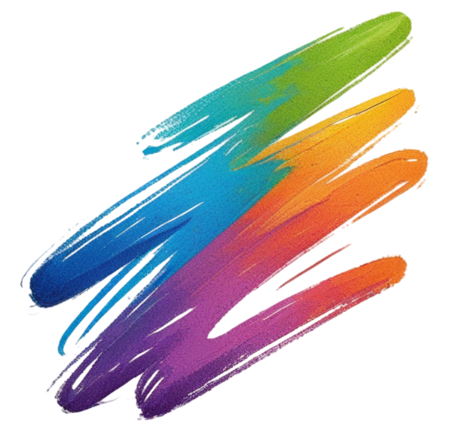

# ✏️ Squiggo 🎨

<p align="center">
  
</p>

Welcome to **Squiggo** – a multiplayer drawing & guessing game built during the building phase.  
Grab your friends, test your doodling skills, and guess what’s being drawn in real-time! 🖌️

---

## 🚀 Features (Building Phase)
- 🎨 Real-time drawing on canvas  
- 💬 Live chat for sending guesses  
- 👥 Multiplayer support using WebSockets  
- 🏆 Scoreboard (coming soon...)  
- 🕹️ Game lobby creation & joining (under construction)  

---

## 🛠️ Tech Stack
- **Frontend:** React + TailwindCSS  
- **Backend:** Node.js + Express + WebSockets  
- **Database:** Postgres + Prisma ORM    

---

## 📦 Installation

Clone the repo & join the phase of building it your own way:
```bash
git clone https://github.com/toffee-k21/squiggo.git
cd squiggo


